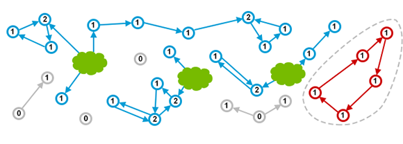

> #### 说明: 
>
> 在本文中, `Garbage Collection` 翻译为 “`垃圾收集`”,  `garbage collector` 翻译为 “`垃圾收集器`”;  
>
> 一般认为, **垃圾回收** 和 **垃圾收集** 是同义词。
>
> `Minor GC` 翻译为： **小型GC**; 而不是 <del>次要GC</del>
>
> `Major GC` 翻译为： **大型GC**; 而不是 <del>主要GC</del>
>
> 原因在于,大部分情况下, 发生在年轻代的 `Minor GC` 次数会很多,翻译为<del>次要GC</del>明显不对。
>
> `Full GC` 翻译为： **完全GC**; 为了清晰起见,一般直接译为 Full GC,读者明白即可; 其中大型GC和完全GC差不多, 这些术语出自官方的各种分析工具和垃圾收集日志。并不是很统一。

# 1. 垃圾回收简介

顾名思义,垃圾收集(Garbage Collection)的意思就是 —— 找到垃圾并进行清理。但现有的垃圾收集实现却恰恰相反: **垃圾收集器跟踪所有正在使用的对象,并把其余部分当做垃圾**。记住这一点以后,  我们再深入讲解内存自动回收的原理，探究 JVM 中垃圾收集的具体实现, 。

我们不抠细节, 先从基础开始, 介绍垃圾收集的一般特征、核心概念以及实现算法。

> **免责声明**:  本文主要讲解 Oracle Hotspot 和 OpenJDK 的行为。对于其他JVM, 如 jRockit 或者 IBM J9, 在某些方面可能会略有不同。

## 手动内存管理(Manual Memory Management)

当今的自动垃圾收集算法极为先进, 但我们先来看看什么是手动内存管理。在那个时候, 如果要存储共享数据, 必须显式地进行 内存分配(allocate)和内存释放(free)。如果忘记释放, 则对应的那块内存不能再次使用。内存一直被占着, 却不再使用，这种情况就称为**内存泄漏**(`memory leak`)。

以下是用C语言来手动管理内存的一个示例程序:

	int send_request() {
	    size_t n = read_size();
	    int *elements = malloc(n * sizeof(int));
	
	    if(read_elements(n, elements) < n) {
	        // elements not freed!
	        return -1;
	    }
	
	    // …
	
	    free(elements)
	    return 0;
	}

可以看到,如果程序很长,或者结构比较复杂, 很可能就会忘记释放内存。内存泄漏曾经是个非常普遍的问题, 而且只能通过修复代码来解决。因此,业界迫切希望有一种更好的办法,来自动回收不再使用的内存,完全消除可能的人为错误。这种自动机制被称为 **垃圾收集**(`Garbage Collection`,简称GC)。

### 智能指针(Smart Pointers)

第一代自动垃圾收集算法, 使用的是**引用计数**(reference counting)。针对每个对象, 只需要记住被引用的次数, 当引用计数变为0时,  这个对象就可以被安全地回收(reclaimed)了。一个著名的示例是 C++ 的共享指针(shared pointers):

	int send_request() {
	    size_t n = read_size();
	    shared_ptr<vector<int>> elements 
	              = make_shared<vector<int>>();
	
	    if(read_elements(n, elements) < n) {
	        return -1;
	    }
	
	    return 0;
	}

`shared_ptr` 被用来跟踪引用的数量。作为参数传递时这个数字加1, 在离开作用域时这个数字减1。当引用计数变为0时,  `shared_ptr` 自动删除底层的 vector。需要向读者指出的是，这种方式在实际编程中并不常见, 此处仅用于演示。

## 自动内存管理(Automated Memory Management)

上面的C++代码中,我们要显式地声明什么时候需要进行内存管理。但不能让所有的对象都具备这种特征呢? 那样就太方便了, 开发者不再耗费脑细胞, 去考虑要在何处进行内存清理。运行时环境会自动算出哪些内存不再使用，并将其释放。换句话说,  **自动进行收集垃圾**。第一款垃圾收集器是1959年为Lisp语言开发的, 此后 Lisp 的垃圾收集技术也一直处于业界领先水平。

### 引用计数(Reference Counting)

刚刚演示的C++共享指针方式, 可以应用到所有对象。许多语言都采用这种方法, 包括 Perl、Python 和 PHP 等。下图很好地展示了这种方式:

绿色的云(GC ROOTS) 表示程序正在使用的对象。从技术上讲, 这些可能是当前正在执行的方法中的局部变量，或者是静态变量一类。在某些编程语言中,可能叫法不太一样,这里不必抠名词。 

蓝色的圆圈表示可以引用到的对象, 里面的数字就是引用计数。然后, 灰色的圆圈是各个作用域都不再引用的对象。灰色的对象被认为是垃圾, 随时会被垃圾收集器清理。

看起来很棒, 是吧!  但这种方式有个大坑, 很容易被**循环引用**(`detached cycle`) 给搞死。任何作用域中都没有引用指向这些对象，但由于循环引用, 导致引用计数一直大于零。如下图所示:

看到了吗?  红色的对象实际上属于垃圾。但由于引用计数的局限, 所以存在内存泄漏。

当然也有一些办法来应对这种情况, 例如 “**弱引用**”(‘weak’ references), 或者使用另外的算法来排查循环引用等。前面提到的 Perl、Python 和PHP 等语言, 都使用了某些方式来解决循环引用问题, 但本文不对其进行讨论。下面介绍JVM中使用的垃圾收集方法。

### 标记-清除(Mark and Sweep)

首先, JVM 明确定义了什么是对象的可达性(reachability)。我们前面所说的绿色云这种只能算是模糊的定义,  JVM 中有一类很明确很具体的对象, 称为 **垃圾收集根元素**(`Garbage Collection Roots`)，包括:

- 局部变量(Local variables)
- 活动线程(Active threads)
- 静态域(Static fields)
- JNI引用(JNI references)
- 其他对象(稍后介绍 ...)

JVM使用**标记-清除算法**(Mark and Sweep algorithm), 来跟踪所有的可达对象(即存活对象), 确保所有不可达对象(non-reachable objects)占用的内存都能被重用。其中包含两步:

- **`Marking`**(标记): 遍历所有的可达对象,并在本地内存(native)中分门别类记下。

- **`Sweeping`**(清除): 这一步保证了,不可达对象所占用的内存, 在之后进行内存分配时可以重用。

JVM中包含了多种GC算法, 如Parallel Scavenge(并行清除), Parallel Mark+Copy(并行标记+复制) 以及 CMS, 他们在实现上略有不同, 但理论上都采用了以上两个步骤。

标记清除算法最重要的优势, 就是不再因为循环引用而导致内存泄露:

而不好的地方在于, 垃圾收集过程中, 需要暂停应用程序的所有线程。假如不暂停,则对象间的引用关系会一直不停地发生变化, 那样就没法进行统计了。这种情况叫做 **STW停顿**(**`Stop The World pause`**, 全线暂停), 让应用程序暂时停止，让JVM进行内存清理工作。有很多原因会触发 STW停顿,  其中垃圾收集是最主要的因素。

在本手册中,我们将介绍JVM中垃圾收集的实现原理，以及如何高效地利用GC。

原文链接: [What Is Garbage Collection?](https://plumbr.eu/handbook/what-is-garbage-collection)

翻译人员: [铁锚 http://blog.csdn.net/renfufei](http://blog.csdn.net/renfufei)

翻译时间: 2015年10月26日
